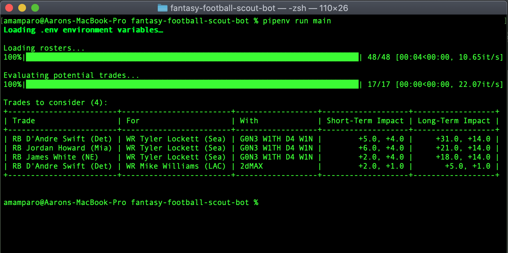

# Fantasy Football Auto Scout

## Requirements
- Python 3.7.x
- [Pipenv](https://pypi.org/project/pipenv/)
- An active Yahoo Fantasy Football team

## Setup
Just install the pip dependencies with `pipenv install`

## Environment Variables
- `LEAGUE_ID` - this can be retrieved from the URL on any league page
- `SEASON` - the 4-digit year of the current NFL season
- `WEEKS` - total number of weeks in your league
- `REQUEST_COOKIE` - The value of the `cookie` HTTP header that gets passed around as you navigate through your Yahoo Fantasy Football league in the web browser (you'll need to use your browser's dev tools to grab this value)
- `QB` - Your league's setting for total quarterbacks in a starting lineup
- `RB` - Your league's setting for total running backs in a starting lineup (not including the FLEX slot)
- `WR` - Your league's setting for total wide receivers in a starting lineup (not including the FLEX slot)
- `TE` - Your league's setting for total tight ends in a starting lineup (not including the FLEX slot)
- `K` - Your league's setting for total kickers in a starting lineup
- `DEF` - Your league's setting for total defenses in a starting lineup
- `HAS_FLEX` - `true` if you're league is configured to include the "FLEX" position, else `false`

## To Run
`pipenv run scout_trades`

## TODO
- deploy this as a once-daily process on AWS that emails the report to me
- add additional scouting tasks for things like finding a waiver/FA prospect, reminders to optimize my starting lineup, etc